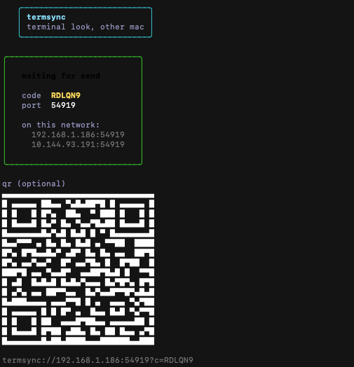

# termsync

Got your terminal dialed in on one Mac and want the same look on another? This copies it over.



Picks up whatever you actually use — Terminal.app, iTerm2, Cursor, VS Code, Alacritty, Kitty, Starship, p10k. Colors, themes, profiles, prompt config. Fonts you install yourself.

## install

```bash
git clone https://github.com/000boil/termsync.git
cd termsync
./install.sh
```

Node 18+. `install.sh` builds and links the `termsync` command.

## same wifi

Receiver (the mac getting the look):

```bash
termsync
# pick 1, or just:
termsync listen
```

Sender (the mac that already looks right):

```bash
termsync
# pick 2, or just:
termsync send
```

Bonjour finds the other machine on the LAN. Type in the pairing code from the receiver screen. Done.

## no wifi

```bash
termsync export --airdrop    # saves to ~/Downloads, opens Finder
termsync import ~/Downloads/termsync-*.tar.gz   # on the other mac
```

## notes

- Restarts aren't automatic — quit and reopen Terminal / iTerm / Cursor after.
- Cursor and VS Code only get terminal-related settings merged in, not your whole config.
- Pairing code is just for the transfer, nothing persists.
